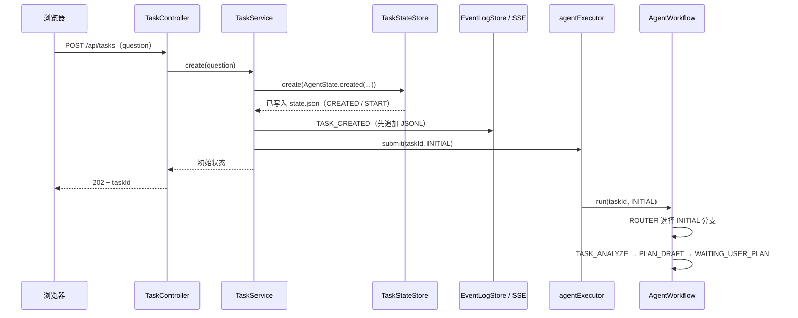
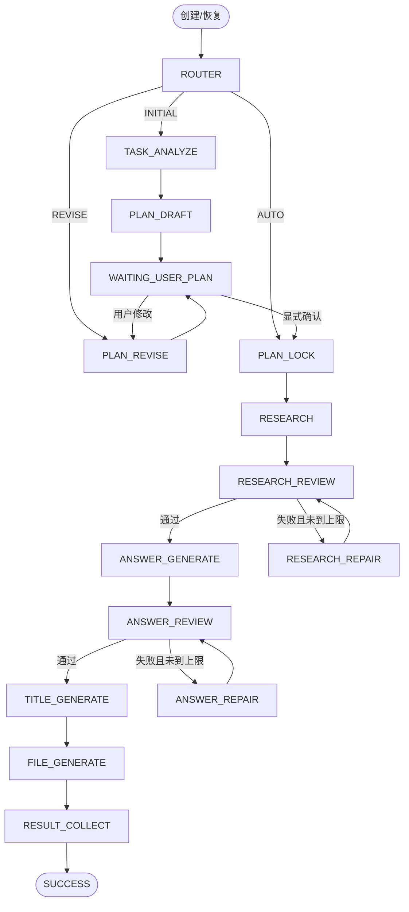

# 工作流流转与排障说明（flowExplain）

> 适用范围：`backend` 中以 Spring AI Alibaba `StateGraph` 驱动的任务工作流。
>
> 阅读本文件的目标不是记住所有类名，而是能回答四个问题：**任务现在处于哪里、状态写到了哪里、接下来为什么会走这条边、失败后该先看什么。**

## 1. 先建立三个关键认知

这个项目中有三种看起来都像“状态”的东西，但职责完全不同。排查时把它们混在一起，是最常见的理解障碍。

| 名称 | 所在位置 | 保存什么 | 是否可用于重启恢复 | 排查时的定位 |
| --- | --- | --- | --- | --- |
| Graph state | `AgentWorkflow` 一次 `graph.invoke(...)` 的内存中 | `taskId`、`runMode`、`researchPassed`、`answerPassed` 等本轮路由变量 | 否 | 只解释“本次调用下一步往哪走” |
| `AgentState` | `data/tasks/{taskId}/state.json` | 任务生命周期、Plan、研究/答案/审核结果、输出文件、错误信息等完整业务快照 | 是 | **任务当前真实状态的唯一来源** |
| `WorkflowEvent` | `data/tasks/{taskId}/events.jsonl` 与 SSE | 过程审计记录、前端进度通知 | 是（可回放） | 解释“任务是怎样走到当前状态的” |

可以把它理解成下面的关系：

```text
HTTP 请求 / 启动恢复
        │
        ▼
TaskService ──提交后台线程──► AgentWorkflow（图：节点与边）
                                  │
                                  ▼
                         TaskWorkflowNodes（业务节点）
                           │              │
             短事务更新 ───┘              └── 调用 LLM / 写中间工件
                           │
                           ▼
                    TaskStateStore
                           │
              state.json（当前真相）
                           │
              状态变化后发布事件
                           ▼
          EventLogStore → events.jsonl → TaskEventService → SSE 浏览器
```

### 1.1 最重要的边界：Graph 不保存业务数据

`AgentWorkflow` 中编译的 `StateGraph` 只定义了节点、条件边和一次调用所需的最小变量。它不会保存完整的 Plan、研究结果、答案，也不能作为断点恢复来源。

例如，`RESEARCH_REVIEW` 返回 `true/false` 后，Graph 临时保存的是 `researchPassed`，仅用于在本轮调用中选择 `ANSWER_GENERATE` 或 `RESEARCH_REPAIR`。审核详情、失败主题和轮次则由业务节点写入 `AgentState.reviewResults`、`researchReviewRound` 以及 `reviews/*.json`。

因此：

- 服务重启后，Graph 的内存已经消失；恢复逻辑必须重新读取 `state.json`。
- 浏览器 SSE 断线后，内存中的 `SseEmitter` 已经没有价值；客户端应通过 `events.jsonl` 回放事件。
- 不要通过 Graph 内存变量判断一个任务是否完成；应查询 `GET /api/tasks/{taskId}` 或直接查看 `state.json`。

## 2. 从一次请求到后台执行：谁负责什么

### 2.1 创建任务的调用链

用户提交 `POST /api/tasks` 后，HTTP 请求不会等待模型生成完成，而是立即得到 `202 Accepted` 与 `taskId`。实际过程如下：



对应代码职责如下：

| 类 | 主要职责 | 不负责什么 |
| --- | --- | --- |
| `TaskController` | HTTP 参数校验、返回 `202`、建立 SSE | 不调用 LLM，不决定工作流分支 |
| `TaskService` | API 状态前置校验、创建/取消/恢复、提交后台任务、统一固化失败 | 不生成 Plan、研究或文件 |
| `AgentWorkflow` | 图节点、普通边、条件边和路由 | 不保存完整业务状态，不做领域校验 |
| `TaskWorkflowNodes` | 每个节点的状态切换、LLM 调用、审核、工件和最终文件 | 不直接处理 HTTP 请求 |
| `TaskStateStore` | `state.json` 的读、改、原子写和任务锁 | 不决定下一节点 |
| `TaskEventService` / `EventLogStore` | 事件持久化、SSE 实时推送与重放 | 不作为任务状态真相 |

### 2.2 三种 `runMode` 是三个合法入口

`TaskService.submit(taskId, mode)` 最终调用 `AgentWorkflow.run(taskId, mode)`。`ROUTER` 节点只根据 Java 传入的固定字符串选择入口；模型输出不会控制路由。

| `runMode` | 由谁触发 | `ROUTER` 后的第一业务节点 | 用途 |
| --- | --- | --- | --- |
| `INITIAL` | 创建任务；部分启动恢复 | `TASK_ANALYZE` | 分析问题并生成首版 Plan |
| `REVISE` | 用户提交 Plan 修改意见；修订中断后的恢复 | `PLAN_REVISE` | 基于已持久化的 `pendingPlanFeedback` 生成新版本 Plan |
| `AUTO` | 用户显式确认 Plan；锁定后的恢复 | `PLAN_LOCK` | 锁定已确认 Plan 后跑完整自动链路 |

`ROUTER`、`WAITING_USER_PLAN` 是图中的标记/路由节点，并不等价于每次都会写 `AgentState.currentNode`。真正的业务节点会在开始时自行更新 `currentNode` 和 `status`；Graph wrapper 返回的 `currentNode` 仅存在于该次图调用的内存 state 中。

## 3. 完整状态机：任务会怎样流转

### 3.1 图拓扑



图中 `WAITING_USER_PLAN` 到 `PLAN_REVISE` / `PLAN_LOCK` 的线表示**下一次 HTTP 请求会发起新的 Graph 调用**，不是当前 `graph.invoke` 在等待浏览器输入。第一次图调用到达 `WAITING_USER_PLAN` 后就会正常结束，后台线程被释放。

### 3.2 `TaskStatus` 的业务含义

`status` 是给 API、恢复程序和前端看的业务生命周期；`currentNode` 是最近进入的工作流阶段。发生异常时，`TaskService.fail(...)` 会把 `status` 改为 `FAILED`，通常会保留出错节点的 `currentNode`，两者要配合看。

| 状态 | 正常进入位置 | 下一步 | 人工该做什么 |
| --- | --- | --- | --- |
| `CREATED` | 初始状态刚落盘 | `ANALYZING` | 通常只会短暂出现 |
| `ANALYZING` | `TASK_ANALYZE` 开始 | `PLAN_DRAFTING` | 观察模型调用和日志 |
| `PLAN_DRAFTING` | `PLAN_DRAFT` 开始 | `WAITING_USER_PLAN` | 等待初稿 |
| `WAITING_USER_PLAN` | 初稿或修订稿完成 | `PLAN_REVISING` 或 `PLAN_LOCKED` | 修改纲要，或调用确认接口 |
| `PLAN_REVISING` | 收到修改意见 / `PLAN_REVISE` | `WAITING_USER_PLAN` | 等待新版；检查 `pendingPlanFeedback` |
| `PLAN_LOCKED` | `PLAN_LOCK` | `RESEARCHING` | Plan 已不可修改 |
| `RESEARCHING` | `RESEARCH` | `RESEARCH_REVIEWING` | 等待各主题研究完成 |
| `RESEARCH_REVIEWING` | `RESEARCH_REVIEW` | 写作或研究修复 | 看 `researchReviewRound` 与 `research:*` 审核结果 |
| `RESEARCH_REPAIRING` | `RESEARCH_REPAIR` | 再次研究审核 | 只重做审核失败主题 |
| `ANSWER_GENERATING` | `ANSWER_GENERATE` | `ANSWER_REVIEWING` | 等待各主题写作完成 |
| `ANSWER_REVIEWING` | `ANSWER_REVIEW` | 标题生成或答案修复 | 看 `answerReviewRound` 与 `answer:*` 审核结果 |
| `ANSWER_REPAIRING` | `ANSWER_REPAIR` | 再次答案审核 | 只重做审核失败主题 |
| `TITLE_GENERATING` | `TITLE_GENERATE` | `FILE_GENERATING` | 生成并净化目录标题 |
| `FILE_GENERATING` | `FILE_GENERATE` | `SUCCESS` | 检查 `outputDirectory`、`outputFiles` |
| `SUCCESS` | `RESULT_COLLECT` | 终态 | 从输出目录取文件 |
| `FAILED` | 任意节点抛出异常后 | 终态 | 根据 `errorCode`、`errorMessage`、`currentNode` 排查 |
| `CANCELLED` | 取消接口 | 终态 | 不应再自动恢复；见第 9 节的现有限制 |

## 4. Human Gate：为什么 Plan 要分“修订、确认、锁定”三步

这个工作流刻意不把“模型生成了 Plan”当成可以自动研究的许可。用户确认是一个严格的人工闸门，拆成三个阶段是为了避免误锁定旧页面或把自然语言“确认”误当作系统命令。

### 4.1 首版 Plan

1. `TASK_ANALYZE` 调用 `llm.analyze(question)`，只接受白名单中的 `taskType`。
2. `PLAN_DRAFT` 调用 `llm.draftPlan(question)`，并检查：版本必须是 `1`、主题数量介于 `1` 和 `maxPlanItems`、每个主题都有非空 `id` 和 `title`。
3. 合法 Plan 同时进入：
   - `AgentState.currentPlan` 和 `planVersion`；
   - `AgentState.planVersions` 的不可变历史；
   - `plans/plan-v1.json` 审计工件。
4. 状态变为 `WAITING_USER_PLAN`，依次发出 `PLAN_GENERATED`、`PLAN_WAITING_USER`，当前 Graph 调用结束。

### 4.2 用户修改 Plan

`POST /api/tasks/{taskId}/messages` 并不会立刻让 LLM 修改内容。`TaskService.revisePlan(...)` 先在同一次 `TaskStateStore.update(...)` 中做三件事：

1. 确认当前为 `WAITING_USER_PLAN`，且尚未锁定、尚未确认；
2. 把用户原话写入 `pendingPlanFeedback`；
3. 把状态改为 `PLAN_REVISING`。

随后才发 `PLAN_REVISION_RECEIVED` 事件并异步提交 `REVISE`。这样即使服务在异步线程开始前崩溃，恢复程序仍能从 `pendingPlanFeedback` 知道需要重放哪一条意见。

`PLAN_REVISE` 会读取旧 Plan 与待处理意见，要求新 Plan 的版本恰好是旧版本 `+1`。成功后：

- 清空 `pendingPlanFeedback`，防止恢复时重复应用同一条意见；
- 写入 `planFeedbackHistory`、`planVersions` 和 `plans/plan-v{n}.json`；
- 把 `currentPlan` 换成新版，并回到 `WAITING_USER_PLAN`。

### 4.3 显式确认和真正锁定

`POST /api/tasks/{taskId}/plan/confirm` 必须携带浏览器正在显示的 `planVersion`。`TaskService.confirmPlan(...)` 会检查：

- 当前状态确实是 `WAITING_USER_PLAN`；
- 当前 Plan 存在；
- 从未确认过；
- 请求版本同时等于 `AgentState.planVersion` 和 `currentPlan.version()`。

检查通过后，状态文件只会先写 `planConfirmed = true`，发出 `PLAN_CONFIRMED`，并提交 `AUTO`。真正的锁定发生在后台 `PLAN_LOCK` 节点：它设置 `planLocked = true`、状态 `PLAN_LOCKED`，并把当前 `PlanVersion` 标记为 `locked=true`、写入 `confirmedAt`。

这意味着 `PLAN_CONFIRMED` 到 `PLAN_LOCKED` 之间存在一个很短的异步窗口：**确认已经落盘，但自动阶段还没真正开始。** 正常情况下几乎瞬间完成；若它持续很久，应优先检查后台线程池和日志。

## 5. 自动阶段：每个节点读什么、写什么、为何能恢复

下面的表格是读代码时最实用的索引。所有状态改动都通过 `TaskStateStore.update` 完成；LLM 调用不放在任务锁内。

| 图节点 | 进入后的 `status` / `currentNode` | 主要输入 | 持久化结果与事件 | 下一步 |
| --- | --- | --- | --- | --- |
| `PLAN_LOCK` | `PLAN_LOCKED` / `PLAN_LOCK` | 已确认的当前 Plan | `planLocked`、确认时间；`PLAN_LOCKED` | `RESEARCH` |
| `RESEARCH` | `RESEARCHING` / `RESEARCH` | Plan 的每个 `PlanItem` | `researchResults[topicId]`、`research/{topicId}.json`；`RESEARCH_STARTED`、逐主题 `RESEARCH_PROGRESS` | `RESEARCH_REVIEW` |
| `RESEARCH_REVIEW` | `RESEARCH_REVIEWING` / `RESEARCH_REVIEW` | 每个主题的研究结果 | `researchReviewRound` 加一、`reviewResults[research:{topicId}]`、`reviews/research-{topicId}.json`；`RESEARCH_REVIEWING` | 全通过写作；否则修复 |
| `RESEARCH_REPAIR` | `RESEARCH_REPAIRING` / `RESEARCH_REPAIR` | 审核结果中 `passed=false` 的主题 | 仅覆盖这些主题的研究结果和工件；`RESEARCH_REPAIRED` | 回到研究审核 |
| `ANSWER_GENERATE` | `ANSWER_GENERATING` / `ANSWER_GENERATE` | 已审核研究结果 | `answers[topicId]`、`answers/{topicId}.json`；`ANSWER_STARTED`、逐主题 `ANSWER_PROGRESS` | `ANSWER_REVIEW` |
| `ANSWER_REVIEW` | `ANSWER_REVIEWING` / `ANSWER_REVIEW` | 每个主题答案 | `answerReviewRound` 加一、`reviewResults[answer:{topicId}]`、`reviews/answer-{topicId}.json`；`ANSWER_REVIEWING` | 全通过标题；否则修复 |
| `ANSWER_REPAIR` | `ANSWER_REPAIRING` / `ANSWER_REPAIR` | 未通过答案的主题 | 仅覆盖失败主题答案和工件；`ANSWER_REPAIRED` | 回到答案审核 |
| `TITLE_GENERATE` | `TITLE_GENERATING` / `TITLE_GENERATE` | 问题与 Plan | `title`；模型标题先经过文件名净化 | `FILE_GENERATE` |
| `FILE_GENERATE` | `FILE_GENERATING` / `FILE_GENERATE` | Plan、答案、标题 | `outputDirectory`、`outputFiles`；最终 Markdown、`metadata.json`；`FILE_GENERATING`、逐文件 `FILE_WRITTEN` | `RESULT_COLLECT` |
| `RESULT_COLLECT` | `SUCCESS` / `RESULT_COLLECT` | 已写文件清单 | `TASK_SUCCESS` | Graph 结束 |

### 5.1 主题为什么能并行，又为什么不会互相覆盖

`RESEARCH` 和 `ANSWER_GENERATE` 会找出尚未写入 Map 的主题，并通过 `CompletableFuture.runAsync(..., agentExecutor)` 并行调用模型。每个主题都遵守同一模式：

```text
读取一次最新 state.json 快照
        ↓
调用 LLM（不持有任务锁）
        ↓
校验返回的 topicId 必须等于当前 PlanItem.id
        ↓
TaskStateStore.update：只写自己的 Map 键
        ↓
写 research/ 或 answers/ 下的单主题 JSON 工件
        ↓
发布进度事件
```

并行并不等于同时写同一个 `state.json`：`TaskStateStore` 会按 `taskId` 对写操作串行化。这样 A、B 两个主题先后完成时，B 的更新会基于 A 已落盘的最新快照，不会把 A 的结果整个覆盖掉。

恢复时，`RESEARCH` / `ANSWER_GENERATE` 只处理 Map 中尚不存在的主题。因此，已经成功落盘的主题不会因服务重启重复调用模型；失败或尚未落盘的主题会重新生成。

### 5.2 审核回环怎么停止

审核节点本身每次都会审核**全部**主题；修复节点只修复 `ReviewResult.passed == false` 的主题。

```text
第 1 次 REVIEW：所有主题审核
   ├─ 全部通过 → 进入下一阶段
   └─ 有失败 → reviewRound 未达上限？
                   ├─ 是 → REPAIR（仅失败主题）→ 再 REVIEW
                   └─ 否 → 抛出 *_REVIEW_MAX_ROUNDS → FAILED
```

上限来自 `application.yml`：

- `agent.limits.max-research-review-rounds`，默认 `3`；
- `agent.limits.max-answer-review-rounds`，默认 `3`；
- Graph 另有递归上限 `50`，这是框架级最后保护，不是正常的业务结束条件。

审核详情分别使用 `research:{topicId}`、`answer:{topicId}` 作为 `reviewResults` 的键，因此必须带上前缀判断，不能只按 `topicId` 查询。

## 6. `AgentState`：`state.json` 每个区域都代表什么

`AgentState` 是一个可被 Jackson 完整反序列化的 Java Bean。不要把它当作只给前端返回的 DTO；它就是断点恢复所依赖的数据库替代物。

| 字段区域 | 关键字段 | 何时写入 | 排查价值 |
| --- | --- | --- | --- |
| 身份与时间 | `taskId`、`question`、`createdAt`、`updatedAt` | 创建时；业务 setter 会刷新 `updatedAt` | 先确认看到的是正确任务和最新快照 |
| 当前生命周期 | `status`、`currentNode` | 每个业务节点开始、失败兜底、取消 | 快速缩小到出错阶段；`FAILED + currentNode` 是最重要组合 |
| 问题分析 | `taskType` | `TASK_ANALYZE` 完成 | 判断模型分析结果是否通过白名单校验 |
| Plan 当前值 | `currentPlan`、`planVersion` | 初稿、每次修订 | 用户此刻看到/确认的内容 |
| Plan 审计与闸门 | `planVersions`、`planFeedbackHistory`、`pendingPlanFeedback`、`planConfirmed`、`planLocked` | 修订、确认、锁定 | 判断等待用户、修订恢复、确认版本冲突、是否已不可修改 |
| 研究与写作 | `researchResults`、`answers` | 每个主题模型结果返回后 | 以稳定 `topicId` 为键；缺少哪个键，就知道哪个主题未成功落盘 |
| 审核 | `reviewResults`、`researchReviewRound`、`answerReviewRound` | 每次审核 | 精确确认失败主题、问题说明和已尝试次数 |
| 输出 | `title`、`outputDirectory`、`outputFiles` | 标题与文件阶段 | 不要由前端猜目录；以这些字段为准 |
| 异常/取消 | `errorCode`、`errorMessage`、`cancelRequested` | 统一失败处理或取消 API | 确认终态来源；取消不等于已经停止网络请求 |

一个典型的失败快照应这样解读：

```json
{
  "status": "FAILED",
  "currentNode": "ANSWER_REVIEW",
  "answerReviewRound": 3,
  "errorCode": "ANSWER_REVIEW_MAX_ROUNDS",
  "errorMessage": "内容审核达到最大修复次数"
}
```

含义不是“文件写坏了”，而是“答案审核已执行到第 3 轮，仍有至少一个主题未通过，业务上限主动终止”。下一步应看 `reviewResults` 中 `answer:*` 条目与 `reviews/answer-*.json`，而不是从头重跑整个任务。

## 7. `TaskStateStore`：为什么它是唯一真相，如何保证不写坏 JSON

### 7.1 文件布局

在默认 `agent.storage.root=./data` 下，每个任务固定拥有一个目录：

```text
data/tasks/{taskId}/
├── state.json                     # 当前完整快照，唯一业务真相
├── events.jsonl                   # 过程事件，一行一个 JSON
├── plans/
│   ├── plan-v1.json
│   └── plan-v{n}.json
├── research/
│   └── {topicId}.json
├── answers/
│   └── {topicId}.json
└── reviews/
    ├── research-{topicId}.json
    └── answer-{topicId}.json

answer/{净化后的标题}/
├── README.md
├── 01-{主题}.md
└── metadata.json
```

中间工件用于审计、核对模型输出和人工复盘；但恢复判断主要读取 `state.json` 中的 Map 和标记字段，不能只根据某个工件文件是否存在来推断状态。

### 7.2 `create`、`load`、`update` 的语义

| 方法 | 做什么 | 使用时机 |
| --- | --- | --- |
| `create(state)` | 建立任务目录与四个工件目录，再写初始 `state.json` | 仅新建任务 |
| `load(taskId)` | 在任务锁内反序列化最新 `state.json` | 查询、节点读取、恢复 |
| `update(taskId, mutator)` | 锁内执行“读取最新状态 → 短修改 → 原子替换写回” | 每一次业务状态变更 |
| `list()` | 扫描有 `state.json` 的任务目录并逐个加载 | 历史列表、启动恢复 |
| `file(taskId, subDir, fileName)` | 拼出受控的中间工件路径 | 内部固定目录写工件 |

`update` 的 `mutator` 必须很短，只做内存字段修改。模型调用、文件写入、网络等待不能放在这里，否则一个主题长时间占有任务锁后，其他主题写回、SSE 连接查询和状态读取都会被阻塞。

### 7.3 原子写的过程

每次状态更新不直接覆盖 `state.json`，而是：

```text
内存中的 AgentState
      ↓ JSON 序列化
state.json.tmp
      ↓ Files.move(ATOMIC_MOVE + REPLACE_EXISTING)
state.json
```

若文件系统不支持 `ATOMIC_MOVE`，代码会记录 warn 日志，并降级为 `REPLACE_EXISTING` 移动。这样比直接打开 `state.json` 截断写入更安全：进程中断时通常仍有旧的完整 JSON，而非半个文件。

### 7.4 锁的范围与边界

- 锁是 `ConcurrentHashMap<taskId, ReentrantLock>`，因此**同一任务**的读/改/写串行，不同任务可并行。
- `load` 也使用同一把锁，特别是为兼容 Windows 上“一个线程移动文件、另一个线程读取文件”可能发生的冲突。
- `ReentrantLock` 允许 `update` 内部调用 `load`，不会让同一线程自锁。
- 锁只在当前 JVM 内有效。项目是单机 V1；若多个进程/实例共用同一 `data` 根目录，现有锁和固定 `.tmp` 文件名不足以保证跨进程一致性。

## 8. 事件与 SSE：前端进度为什么可能与文件快照不同步

### 8.1 事件的可靠性顺序

`TaskEventService.publish(...)` 的固定顺序是：

```text
EventLogStore.append（先写 events.jsonl）
        ↓
遍历当前内存 SseEmitter，尽力实时发送
        ↓
单个连接失败只移除该连接，不影响工作流
```

浏览器连接 `GET /api/tasks/{taskId}/events` 时的顺序则是：

```text
从 state.json 读取一个快照
        ↓
发送 TASK_SNAPSHOT
        ↓
读取 events.jsonl 中 eventId > afterId 的历史事件并回放
        ↓
继续接收实时事件
```

因此，前端应把 `TASK_SNAPSHOT` 当作当前展示的基线，把 `eventId` 当作去重与断线续传游标。`Last-Event-ID` 请求头和 `afterId` 参数均可表达这个游标。

### 8.2 状态文件与事件日志不是一个跨文件事务

大多数节点遵循“更新状态 → 写工件 → 发布事件”或“更新状态 → 发布事件”的顺序，但 `state.json`、工件 JSON、`events.jsonl` 是独立文件，项目没有跨文件事务。由此可能出现以下可解释的短暂或故障后差异：

- 状态已写入，但写工件失败，随后任务进入 `FAILED`；
- 状态已写入，但事件追加失败，前端没收到该过程事件；重新查询详情仍能看到真实状态；
- 工件已写入，但进程在发布进度事件前退出；恢复时会以 `state.json` 为准继续；
- SSE 实时发送失败，但事件已在 JSONL 中，可在重连时回放。

所以排查“页面没动”时，顺序应是：**先查 API/`state.json`，再查 `events.jsonl`，最后才判断 SSE 连接。** 不要反过来只凭页面进度判定后端停住。

### 8.3 常见事件类型索引

| 阶段 | 事件 |
| --- | --- |
| 创建与恢复 | `TASK_CREATED`、`TASK_RECOVERY_STARTED` |
| Plan | `TASK_ANALYZED`、`PLAN_GENERATED`、`PLAN_WAITING_USER`、`PLAN_REVISION_RECEIVED`、`PLAN_REVISED`、`PLAN_CONFIRMED`、`PLAN_LOCKED` |
| 研究 | `RESEARCH_STARTED`、`RESEARCH_PROGRESS`、`RESEARCH_REVIEWING`、`RESEARCH_REVIEW_FAILED`、`RESEARCH_REPAIRED` |
| 答案 | `ANSWER_STARTED`、`ANSWER_PROGRESS`、`ANSWER_REVIEWING`、`ANSWER_REVIEW_FAILED`、`ANSWER_REPAIRED` |
| 文件与终态 | `FILE_GENERATING`、`FILE_WRITTEN`、`TASK_SUCCESS`、`TASK_FAILED`、`WORKFLOW_CANCELLED` |

## 9. 失败、取消与恢复：真实执行语义

### 9.1 任何节点异常如何变成 `FAILED`

流程如下：

```text
TaskWorkflowNodes / Graph 节点抛异常
        ↓
AgentWorkflow 记录 taskId、节点、耗时、完整异常栈并继续抛出
        ↓
TaskService 后台任务捕获异常
        ↓
若任务未被取消：state.json → FAILED + errorCode + errorMessage
        ↓
发布 TASK_FAILED（事件写入失败会被再次记录日志）
```

`TaskException` 的 `code` 会原样成为 `errorCode`；其他异常统一为 `UNKNOWN_ERROR`。常见错误码如下：

| 错误码 | 常见含义 | 先检查 |
| --- | --- | --- |
| `LLM_INVALID_OUTPUT` | 模型返回的 taskType、Plan 版本/主题，或主题 `topicId` 不符合 Java 约束 | 当前节点日志、对应 LLM 适配器、Plan/工件 JSON |
| `PLAN_REVISION_FAILED` | 不在可修订状态、已锁定，或缺少待处理意见 | `status`、`planLocked`、`planConfirmed`、`pendingPlanFeedback` |
| `PLAN_CONFIRM_FAILED` | 非等待态确认、Plan 不存在、重复确认或版本过期 | 请求的版本与 `planVersion/currentPlan.version` |
| `RESEARCH_REVIEW_MAX_ROUNDS` | 研究审核连续失败达到配置上限 | `researchReviewRound`、`research:*` 审核工件 |
| `ANSWER_REVIEW_MAX_ROUNDS` | 答案审核连续失败达到配置上限 | `answerReviewRound`、`answer:*` 审核工件 |
| `FILE_WRITE_FAILED` | 中间工件或最终 Markdown/metadata 写入失败 | 输出根目录权限、磁盘空间、目标文件、异常栈 |
| `WORKFLOW_CANCELLED` | 节点在检查点发现取消标记 | `cancelRequested`、取消事件和发生时间 |
| `UNKNOWN_ERROR` | 不是领域异常的框架、JSON、文件或运行时异常 | `knowledge-agent.log` 中同一 taskId 的完整异常栈 |

### 9.2 取消不是强杀线程

`POST /api/tasks/{taskId}/cancel` 会立即把状态写成 `CANCELLED`、`currentNode=CANCELLED`、`cancelRequested=true`，然后发布 `WORKFLOW_CANCELLED`。它不会中断正在进行的远程 HTTP 模型请求，因为强制中断可能打断状态文件写入或网络客户端。

节点通过 `ensureNotCancelled(taskId)` 在安全点读取标记并抛出 `WORKFLOW_CANCELLED`；`TaskService.fail(...)` 发现任务已取消后，不会把较晚返回的异常覆盖成 `FAILED`。

### 9.3 服务重启时的恢复路由

应用启动后，`TaskRecoveryRunner` 调用 `TaskService.recoverIncompleteTasks()`：

| 恢复扫描时的状态 | 动作 |
| --- | --- |
| `WAITING_USER_PLAN`、`SUCCESS`、`FAILED`、`CANCELLED` | 跳过，不重新提交 |
| `PLAN_REVISING` | 发布 `TASK_RECOVERY_STARTED`，按 `REVISE` 入口恢复 |
| 其他非终态且 `planConfirmed=true` 或 `planLocked=true` | 按 `AUTO` 入口恢复 |
| 其他非终态 | 按 `INITIAL` 入口恢复 |

恢复并不从“上次执行到第几条 Graph 边”继续，而是重新进入上述入口。节点的幂等设计承担去重责任：已存在的 research/answer Map 项会跳过，已经锁定的 `PLAN_LOCK` 直接返回，文件阶段已有 `outputDirectory` 时会复用同一目录。

## 10. 排障手册：按现象定位，而不是盲目重试

以下命令中的 `{taskId}` 请替换为真实 ID。PowerShell 下可直接执行。

```powershell
# 1) 当前唯一真实状态：先看 status、currentNode、错误码和关键标记
Get-Content -Raw ".\data\tasks\{taskId}\state.json"

# 2) 历史事件：按时间/事件编号了解发生顺序
Get-Content ".\data\tasks\{taskId}\events.jsonl"

# 3) 只筛该任务的后端日志（日志默认路径可由 LOG_FILE 覆盖）
rg -n "taskId={taskId}" ".\logs\knowledge-agent.log"

# 4) 查看本任务所有中间工件；先从当前节点对应目录开始
Get-ChildItem -Recurse ".\data\tasks\{taskId}" | Select-Object FullName, Length, LastWriteTime
```

### 10.1 现象 → 判断 → 第一检查点

| 现象 | 先判断 | 第一检查点 |
| --- | --- | --- |
| 一直 `WAITING_USER_PLAN` | 这是正常 Human Gate，还是确认后未继续？ | `planConfirmed`：`false` 表示等待用户；`true` 但长期未锁定时看第 11 节风险 2 |
| 长时间 `PLAN_REVISING` | 修改意见是否已持久化、后台是否被调度 | `pendingPlanFeedback`、`PLAN_REVISION_RECEIVED` 事件、`PLAN_REVISE` 日志 |
| `RESEARCHING` / `ANSWER_GENERATING` 很久不动 | 某个模型调用慢、线程池饥饿，还是某主题已经异常 | 当前 Map 的键数量、最后一条 `*_PROGRESS`、线程池配置、日志耗时 |
| 反复研究/答案修复 | 是哪些主题没通过 | `reviewResults` 和 `reviews/research-*.json` / `reviews/answer-*.json` 的 `issues` |
| 直接 `FAILED` | 错在模型、状态校验、文件还是图执行 | `errorCode` + `currentNode` + 同一 `taskId` 的完整异常栈 |
| 前端不更新但任务实际上已完成 | SSE 连接/事件回放问题，不一定是工作流问题 | `GET /api/tasks/{taskId}` 或 `state.json`，然后再看 JSONL 是否有终态事件 |
| 重启后任务没有继续 | 它是否本来就在等待人工/终态，或恢复路由不满足 | `status`、`planConfirmed`、`planLocked`、启动期 `TASK_RECOVERY_STARTED` |
| 最终目录/文件缺失 | 文件阶段中断，还是任务已成功但前端猜错路径 | `outputDirectory`、`outputFiles`、`FILE_WRITTEN`、`FILE_WRITE_FAILED` |

### 10.2 以当前节点为中心检查工件

| `currentNode` | 重点文件/字段 | 典型问题 |
| --- | --- | --- |
| `TASK_ANALYZE` | `question`、`taskType`、`TASK_ANALYZED` | 模型 taskType 不在白名单 |
| `PLAN_DRAFT` / `PLAN_REVISE` | `currentPlan`、`planVersion`、`plans/`、`pendingPlanFeedback` | Plan 版本不连续、主题缺 ID/标题、修订意见缺失 |
| `PLAN_LOCK` | `planConfirmed`、`planLocked`、`planVersions` | 客户端确认版本过期或自动线程尚未执行 |
| `RESEARCH` / `RESEARCH_REPAIR` | `researchResults`、`research/` | 缺少某个 `topicId`、该主题 LLM 调用失败 |
| `RESEARCH_REVIEW` | `researchReviewRound`、`reviewResults[research:*]`、`reviews/` | 审核持续失败或已达到上限 |
| `ANSWER_GENERATE` / `ANSWER_REPAIR` | `answers`、`answers/` | 缺少主题答案或 `topicId` 不匹配 |
| `ANSWER_REVIEW` | `answerReviewRound`、`reviewResults[answer:*]`、`reviews/` | 审核问题未被后续重新生成解决 |
| `TITLE_GENERATE` | `title` | 模型生成失败或标题净化后异常 |
| `FILE_GENERATE` | `outputDirectory`、`outputFiles`、最终 `answer/` 目录 | 权限、磁盘、同名目录、安全路径校验 |
| `RESULT_COLLECT` | `outputFiles`、`TASK_SUCCESS` | 文件阶段是否已经真正完成 |

### 10.3 日志的正确读法

日志中最有价值的关键词是 `taskId`、`node`、`mode`、`status`、`durationMs` 和 `errorCode`。一次异常通常应从下面三组日志串起来：

1. `TaskService`：`后台工作流开始执行`、`后台工作流执行异常`、`任务已固化为失败状态`；
2. `AgentWorkflow`：`工作流节点开始/完成/失败`，其中失败日志带完整异常栈和节点名；
3. `TaskStateStore`：`任务状态已持久化`，可对比 `previousStatus/currentStatus` 与 `previousNode/currentNode`。

优先按 `taskId` 搜索，再看相邻时间的 `node`。不要只搜异常文本，因为同一个异常可能是并行主题中的任意一个线程抛出的。

## 11. 当前实现中应特别留意的边界与风险

本节描述的是当前代码的实际行为，目的是让排查时不会被“理想流程”误导；它们不是本文件自动修复的事项。

### 风险 1：后台工作流和主题并行复用了同一个固定线程池

`TaskService.submit(...)` 使用 `agentExecutor` 执行整个 Graph；而 `RESEARCH` 与 `ANSWER_GENERATE` 又向同一个 `agentExecutor` 提交主题子任务，并在父任务中 `join()` 等待。

这会带来线程饥饿风险：

```text
线程池 parallelism = 4
4 个工作流都进入 RESEARCH
        ↓
4 个父工作流线程都在 join 等待主题子任务
        ↓
主题子任务也只能投递到同一个已经没有空闲线程的池
        ↓
没有线程可运行主题子任务，所有父任务持续等待
```

特别地，当 `agent.executor.parallelism=1` 时，单个工作流进入任意并行主题阶段就可能出现同样问题。若表现为 `RESEARCHING` 或 `ANSWER_GENERATING` 长时间无新的 `*_PROGRESS` 事件、没有模型错误、线程栈大量停在 `CompletableFuture.join()`，应优先怀疑这一点。

### 风险 2：确认已落盘但尚未锁定时重启，可能停留在等待态

确认接口先把 `planConfirmed=true` 写入状态文件，再异步提交 `AUTO`；但恢复扫描对 `WAITING_USER_PLAN` 的判断早于 `planConfirmed` 判断，会直接跳过该状态。

因此，若进程恰好在“确认落盘”和“`PLAN_LOCK` 把状态改为 `PLAN_LOCKED`”之间退出，重启后可能看到：

```json
{
  "status": "WAITING_USER_PLAN",
  "planConfirmed": true,
  "planLocked": false
}
```

这不是等待用户再次确认的正常状态，而是恢复窗口遗漏。排查时不要再次调用确认接口（它会因重复确认被拒绝）；应先保留现场并按这一事实定位恢复路由。

### 风险 3：取消检查点没有覆盖全部自动节点

取消 API 会立刻写入 `CANCELLED`，但当前 `ensureNotCancelled(...)` 只在部分节点/研究主题开始前调用。研究审核、修复、答案生成/审核/修复、标题、文件和结果收集等路径没有统一的入口检查。

如果取消恰好发生在未检查取消标记的阶段，后续节点仍可能写状态，甚至由 `RESULT_COLLECT` 写成 `SUCCESS`。因此出现“已经收到 `WORKFLOW_CANCELLED`，随后又有进度或成功事件”时，不应先怀疑 SSE；应先对照 `events.jsonl` 和 `state.json` 判断是否发生了取消状态被后续节点覆盖。

### 风险 4：状态、工件、事件三者不能原子提交

第 8.2 节已说明它们是分开的文件操作。排查恢复时，优先选择 `state.json`；不要因为某个工件或事件缺失，就手工猜测并改写 `status`。手改状态极易破坏 Plan 版本、审核轮次和 Map 键之间的约束。

### 风险 5：配置中的实际密钥不应落入仓库

真实模型调用失败时，建议确认 `OPENAI_API_KEY`、`OPENAI_BASE_URL`、`OPENAI_MODEL`、连接超时和读取超时的部署环境值。密钥应只通过受控环境变量或密钥管理服务注入，不能写入文档、日志或版本库默认值；排查时也不要把完整请求头、Prompt 或密钥贴到工单中。

## 12. 推荐的排查顺序

遇到问题时按以下顺序执行，通常能在最少信息中定位层级：

1. 查询 `state.json` 或 `GET /api/tasks/{taskId}`，记录 `status`、`currentNode`、`errorCode`、`updatedAt`。
2. 根据 `currentNode` 检查第 10.2 节对应字段和工件，确认是“尚未开始、处理中、结果没落盘”中的哪一种。
3. 查看 `events.jsonl`，判断状态变化是否有对应事件，确认前端进度问题还是后端执行问题。
4. 以 `taskId` 搜后端日志，找到最后一个 `工作流节点开始` 和第一个 `工作流节点失败/完成`，查看完整异常栈与耗时。
5. 只有在确认模型、文件系统或线程池故障后，才决定重试、恢复或修复代码；不要通过直接编辑 `state.json` 跳过审核/锁定步骤。

## 13. 源码阅读地图

想从代码继续深挖时，建议按这个顺序阅读：

1. [`TaskController`](../backend/src/main/java/com/example/agent/controller/TaskController.java)：有哪些 API 命令和 SSE 入口；
2. [`TaskService`](../backend/src/main/java/com/example/agent/service/TaskService.java)：命令校验、异步提交、失败固化与恢复策略；
3. [`AgentWorkflow`](../backend/src/main/java/com/example/agent/workflow/AgentWorkflow.java)：节点拓扑、三种入口与审核条件边；
4. [`TaskWorkflowNodes`](../backend/src/main/java/com/example/agent/service/TaskWorkflowNodes.java)：每个节点实际读写哪些数据；
5. [`AgentState`](../backend/src/main/java/com/example/agent/model/AgentState.java) 和 [`TaskStatus`](../backend/src/main/java/com/example/agent/model/TaskStatus.java)：状态字段和生命周期；
6. [`TaskStateStore`](../backend/src/main/java/com/example/agent/persistence/TaskStateStore.java)：任务锁、原子状态写入；
7. [`EventLogStore`](../backend/src/main/java/com/example/agent/persistence/EventLogStore.java) 与 [`TaskEventService`](../backend/src/main/java/com/example/agent/service/TaskEventService.java)：JSONL、SSE 和重连回放；
8. [`application.yml`](../backend/src/main/resources/application.yml)：并行度、审核上限、存储路径和模型超时。

已有的 [`architecture.md`](architecture.md) 适合快速了解总体设计；本文件则用于逐步跟踪状态流转和现场排障。
